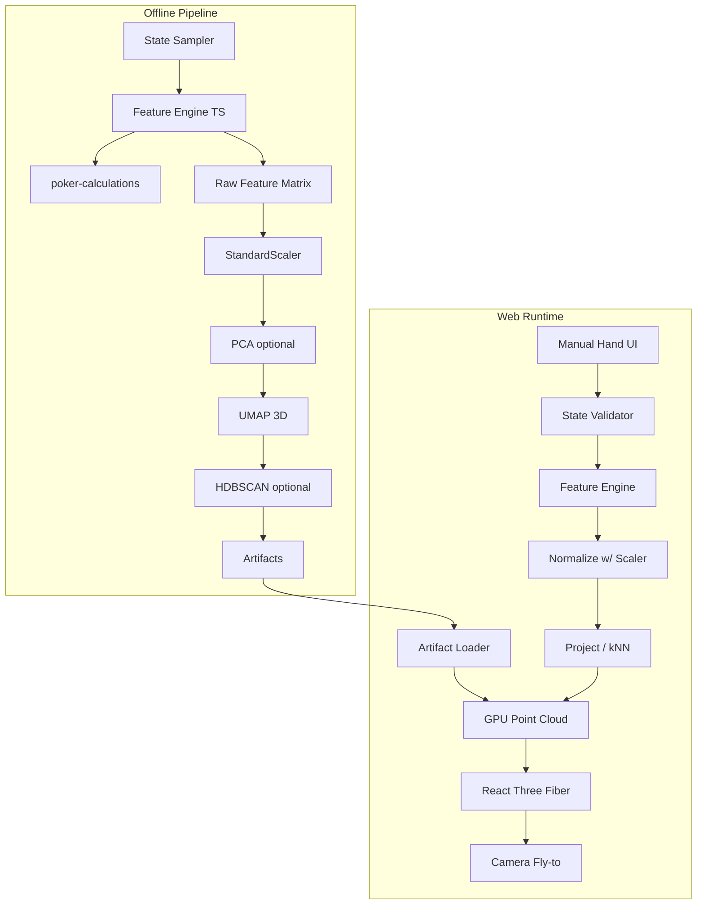
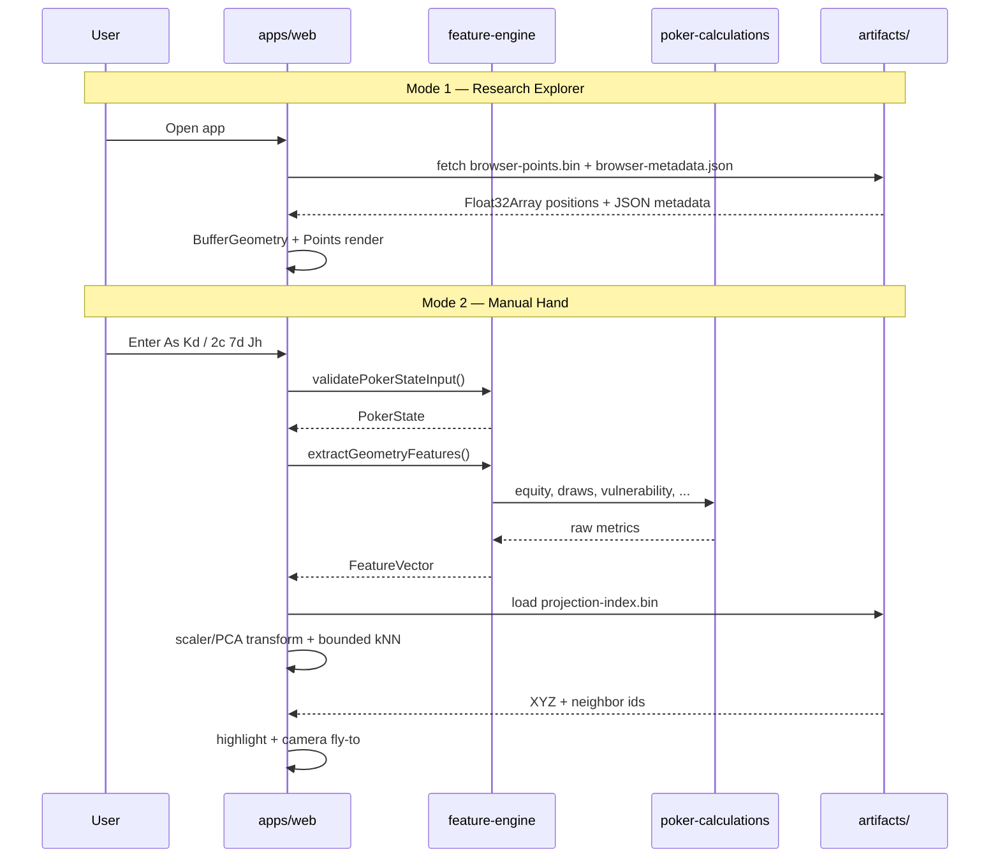

# Geometry of Poker — Architecture

Research-grade interactive 3D visualization of Texas Hold'em state space. Geometry emerges from poker mathematics through feature extraction, standardization, PCA, UMAP, and optional clustering — not from manually designed polytopes.

## System overview



## Monorepo layout

| Path | Role | Runtime |
| --- | --- | --- |
| `apps/web` | Next.js viewer, two application modes | Browser / Vercel |
| `packages/feature-engine` | Feature extraction via `poker-calculations` | Node.js |
| `packages/shared` | Cross-language type contracts | TypeScript |
| `pipeline/` | Embedding, clustering, evaluation | Python 3.11+ |
| `artifacts/` | Generated datasets, models, binaries | Gitignored data |
| `docs/` | Architecture, schema, research notes | Markdown |

## Application modes

### Mode 1: Research Dataset Explorer

Renders a large **precomputed** point cloud. Each point encodes:

- Hero hole cards + community cards + street
- Feature vector (stored in metadata sidecar)
- UMAP XYZ coordinates (binary `Float32` buffer)
- Optional HDBSCAN cluster id

**Performance constraint:** One `BufferGeometry` + `Points` material. Positions and colors live in typed arrays. No React component or mesh per state.

### Mode 2: Manual Hand Explorer

User enters exactly two hero cards and 0/3/4/5 community cards.

Runtime flow:

1. **Validate** — structural checks (`feature-engine/validate-state`)
2. **Extract** — feature vector via `poker-calculations` primitives
3. **Normalize** — apply saved `StandardScaler` from training
4. **Project** — scaler/PCA transform and bounded kNN interpolation via `projection-index.bin`
5. **Highlight** — nearest neighbors in precomputed dataset
6. **Fly camera** — animate to embedding region
7. **Metrics panel** — detailed hand statistics

Villain range configuration is reserved for a later phase.

## Data flow



## Technology decisions

| Layer | Choice | Rationale |
| --- | --- | --- |
| Math primitives | `poker-calculations@2.2.0` (npm) | C++20 core, already covers equity/MC/vulnerability |
| Feature extraction | TypeScript in `feature-engine` | Same language as web; direct package import |
| Embedding | Python (NumPy, sklearn, umap-learn) | Mature ML stack; joblib for scaler/UMAP persistence |
| Web | Next.js 15 App Router | SSR for app and Node API routes |
| 3D | R3F + drei + raw BufferGeometry | GPU point clouds at 100k+ points |
| State | Zustand | Minimal boilerplate for mode + artifact state |
| Package manager | pnpm workspaces | Fast installs, strict dependency graph |

## Artifact contract

Generated files (not committed):

```
artifacts/
  datasets/
    states.jsonl          # sampled states
    features.parquet      # raw + normalized features
  embeddings/
    <street>/
      viewer-manifest.json
      browser-points.bin
      browser-channels.bin
      browser-metadata.json
      retained-features.json
      projection-index.bin
  releases/
    <release-id>/embeddings/<street>/...
```

Versioned release artifacts are uploaded to S3 and served through CloudFront. Local public artifacts are development-only.

## Boundaries — what we do NOT rebuild

The following remain in `poker-calculations`:

- Hand evaluation and category ranking
- Monte Carlo and exact equity
- Runout enumeration
- Card-removal gradients
- Category transition matrices
- Vulnerability calculations

`feature-engine` orchestrates calls and assembles the vector; it does not reimplement poker math.

## Deployment

Target: subdomain of personal website (e.g. `geometry.poker-calculations.devomb.com`).

- **Frontend:** Vercel static/SSR from `apps/web`
- **Artifacts:** Versioned S3/CloudFront release directories; manifest JSON points to URLs
- **Pipeline:** Local or CI batch job; not deployed as a service

## Security and data ethics

- No scraping of hands, cards, or datasets from external sites
- All states generated combinatorially or via Monte Carlo sampling
- No user PII; fully client-side hand entry

## Phase map

See [README.md](../README.md#implementation-checklist) for the full checklist.

| Phase | Scope |
| --- | --- |
| **0** | Scaffold, types, docs |
| **1** | Feature schema finalization + `extractGeometryFeatures` |
| **2** | State sampler + dataset generation |
| **3** | UMAP pipeline + GPU point cloud loader |
| **4** | Manual hand projection + kNN + camera |
| **5** | Clustering visualization + research polish |
| **6** | Talk deck + production deploy |

## Open technical risks

Documented in [README.md](../README.md#open-technical-risks).
