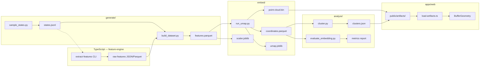

# Pipeline

End-to-end offline pipeline from poker states to web-renderable artifacts.

## Pipeline diagram



## Stage details

### 1. State sampling (`pipeline/generate/sample_states.py`)

- Enumerate or randomly sample **valid** hero + board combinations
- Respect street constraints: 0 / 3 / 4 / 5 community cards
- Deduplicate suit-isomorphic states where appropriate (research decision)
- Output: `artifacts/datasets/states.jsonl`

### 2. Feature extraction (`packages/feature-engine`)

- For each state, call `poker-calculations` primitives
- Assemble vector in `FEATURE_SCHEMA` column order
- Batch via CLI: `pnpm pipeline:extract`
- Output: columnar features appended to dataset

### 3. Dataset assembly (`pipeline/generate/build_dataset.py`)

- Merge states + raw features into Parquet
- Fit `sklearn.preprocessing.StandardScaler` on training corpus
- Persist scaler to `artifacts/models/scaler.joblib`
- Export normalized matrix for embedding

### 4. Embedding (`pipeline/embed/run_umap.py`)

| Step | Tool | Notes |
| --- | --- | --- |
| Optional PCA | `sklearn.decomposition.PCA` | Reduce to ~20–50 dims if feature count grows |
| Manifold learning | `umap.UMAP(n_components=3)` | `metric='euclidean'` on scaled features |
| Export | custom script | Float32 interleaved XYZ → `point-cloud.bin` |
| Metadata | JSON | state ids, cards, features, street |

**Hyperparameters (starting point):**

- `n_neighbors`: 15–30 (scale with dataset size)
- `min_dist`: 0.1–0.5
- `random_state`: fixed for reproducibility

### 5. Clustering (`pipeline/analyze/cluster.py`)

- HDBSCAN on 3D coordinates (or higher-D pre-UMAP features)
- Noise points labeled `-1`
- Summary statistics per cluster for UI legend

### 6. Evaluation (`pipeline/analyze/evaluate_embedding.py`)

- Trustworthiness and continuity vs. feature-space kNN
- Document in `docs/research-notes.md` for talk/portfolio

### 7. Manual projection (`pipeline/embed/project_point.py`)

UMAP `.transform()` support is limited for out-of-sample points. Planned strategies (in priority order):

1. **UMAP parametric extension** — if feasible with `umap-learn`
2. **kNN interpolation** — find k nearest training states in normalized feature space; weighted average of their XYZ
3. **Local linear map** — fit ridge regression from features → XYZ on neighbors

Mode 2 uses strategy 2 initially.

## Commands (future)

```bash
# Full pipeline
python pipeline/generate/sample_states.py --count 100000
pnpm pipeline:extract -- --input artifacts/datasets/states.jsonl
python pipeline/generate/build_dataset.py
python pipeline/embed/run_umap.py
python pipeline/analyze/cluster.py
python pipeline/analyze/evaluate_embedding.py

# Copy artifacts to web public dir
cp artifacts/embeddings/* apps/web/public/artifacts/embeddings/
```

## File formats

### `states.jsonl`

```json
{"id":"s000001","hero":["As","Kd"],"board":[],"street":"preflop"}
```

### `point-cloud.bin`

Binary layout: `[x0,y0,z0, x1,y1,z1, ...]` as little-endian `float32`.

### `metadata.json`

```json
{
  "version": "1.0.0",
  "count": 100000,
  "points": [
    {
      "id": "s000001",
      "hero": ["As","Kd"],
      "board": [],
      "street": "preflop",
      "clusterId": 3,
      "features": [0.12, -0.45, ...]
    }
  ]
}
```

For large N, metadata should be sharded or served via indexed Parquet; the placeholder schema documents intent.
