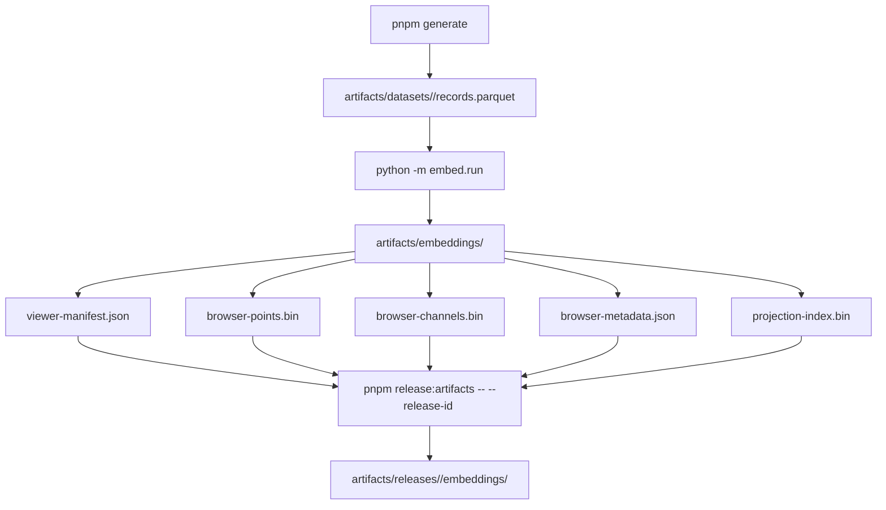

# Pipeline

The production pipeline is real-data-only. It generates poker states through the TypeScript dataset generator, embeds feature parquet files with Python, and publishes versioned browser artifacts for Vercel + CDN consumption.

Production-scale pipeline runs should execute on AWS Batch, not on a laptop. Local pipeline commands are for tiny smoke tests and development diagnostics only.

## Flow



## Commands

Generate the balanced-small release dataset:

```bash
pnpm generate:all
```

Run that command inside the AWS release worker for production releases. On a laptop, keep counts tiny, for example `pnpm generate -- --street flop --count 20 --seed 42 --mode compact`.

Embed all streets:

```bash
pnpm pipeline:embed
```

Build versioned release artifacts:

```bash
pnpm release:artifacts -- --release-id 2026-06-production-1
pnpm validate:artifacts -- --release-id 2026-06-production-1
```

Upload `artifacts/releases/<release-id>/embeddings/<street>/` to S3 under the same release prefix and set Vercel `GOP_ARTIFACT_BASE_URL` to the CloudFront URL for that release.

## Artifact Contract

Each street release must contain:

- `viewer-manifest.json`
- `browser-points.bin` (`GOPK`)
- `browser-channels.bin` (`GOPC`)
- `browser-metadata.json`
- `retained-features.json`
- `projection-index.bin` (`GOPI`)

The app fails closed for missing projection indexes. This prevents non-exact manual hands from using partial summary features.
